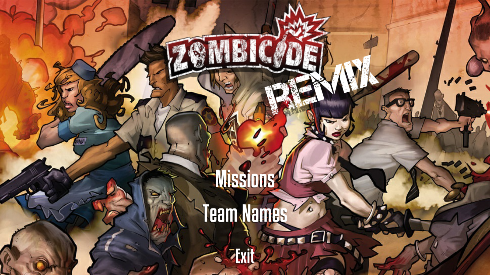
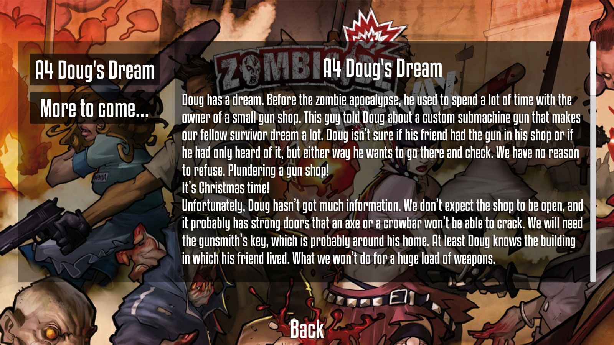
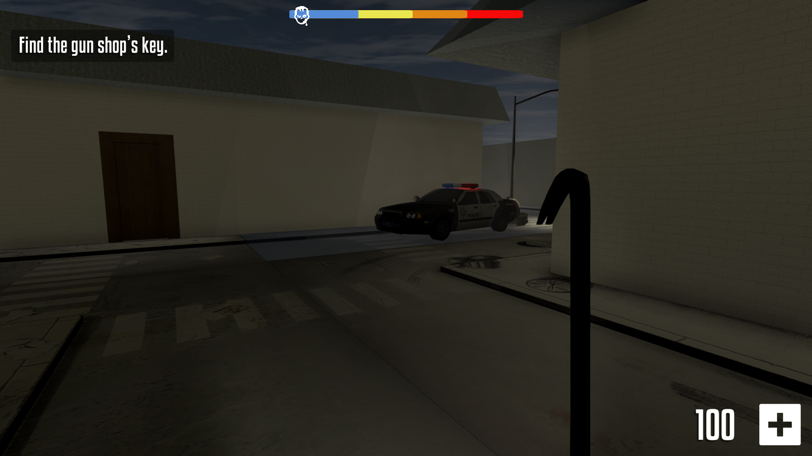
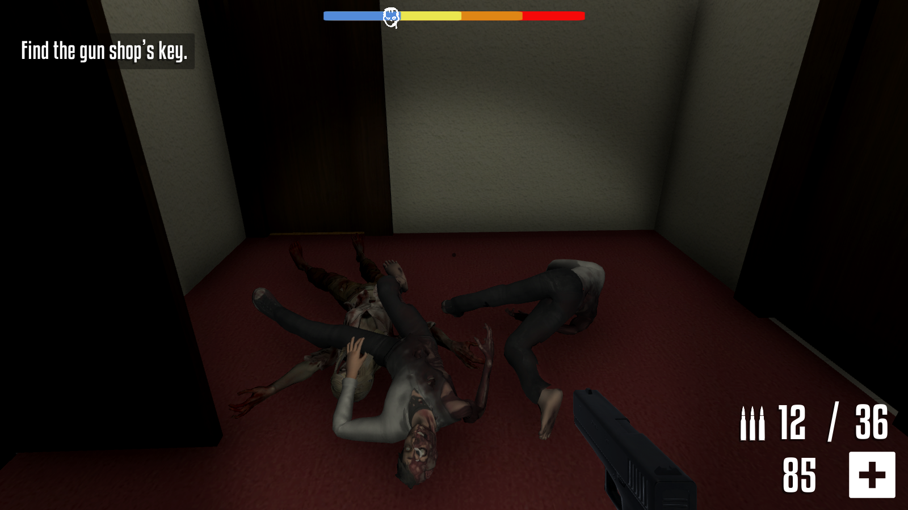
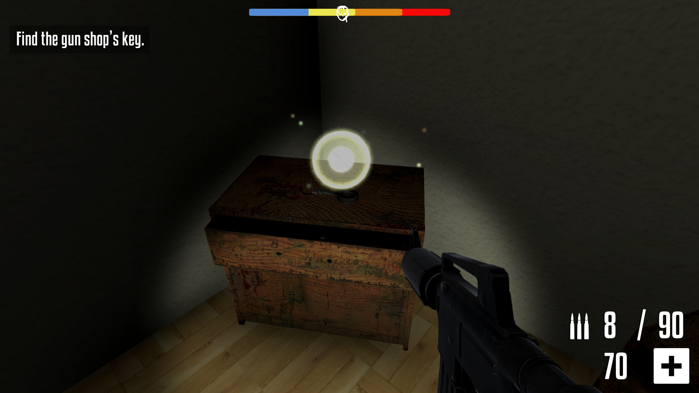
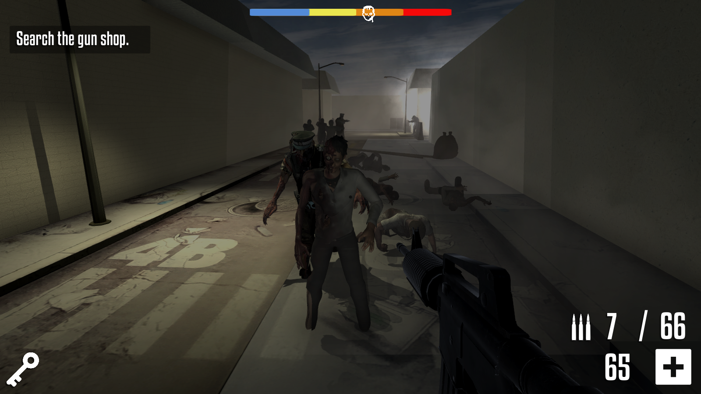
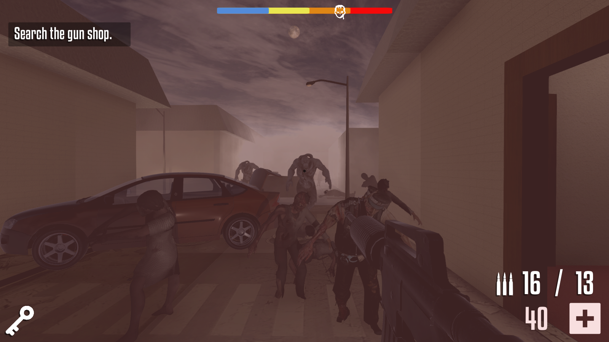

# ZombicideRemix

Unity version: 2017.3.1f1

[EN] 3D game based on boardgame Zombicide, developed in Unity for programming class in Game Design course at Anhembi Morumbi.

Our assignment was to port the boardgame Zombicide to a digital game with Unity and I came up with the idea to make a FPS wave based game. You got some objectives to do following the mission given while zombie waves spawn over time.

I did all the game design and coding, handled everything inside Unity and assets are mostly free assets from Unity Asset Store.

[PT] Jogo 3D baseado no jogo de tabuleiro Zombicide, desenvolvido na Unity para aula de programação do curso de Design de Games da Anhembi Morumbi.

Nosso desafio era portar o jogo de tabuleiro Zombicide em um jogo digital na Unity, a minha ideia foi transformar em um FPS com waves de zumbis. Você tem certos objetivos para cumprir conforme a missão e enquanto isso surgem waves de zumbis com o passar do tempo.

Eu fiz todo o game design e escrevi todo o código, a maioria dos assets são assets grátis da Unity Asset Store.

## Screenshots

## Build

Link to download: https://drive.google.com/open?id=1lJY3wboN-CMNZ4E7ZINBCJlfIsRNRfqv

## Authors
- **Rafael Taue** - Game Designer and Programmer - [GitHub](https://github.com/rtaue) - [Porfolio](https://rtaue.com) - [LinkedIn](https://www.linkedin.com/in/rtaue/)
